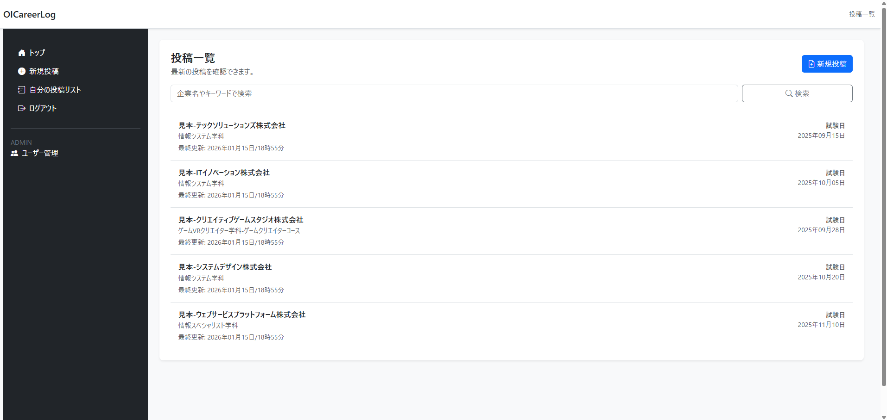

# OICareerLog (オイキャリ)
岡山情報ビジネス学院 令和7年度 情報システム学科 チームIKZM  
OICシステム改善プロジェクト 卒業研究成果物

## 概要
学生が自身の就職活動における選考プロセスや体験談を記録し、後輩たちへ経験・知見として共有するための学内向け就職活動報告プラットフォームです。
情報の蓄積・検索といった基本機能に加え、教員によるユーザー管理や不適切投稿への対応を可能にする運用管理機能を備えています。

### 開発ドキュメント
詳細な設計資料（ER図、クラス図、シーケンス図、入出力項目一覧等）は、[docsディレクトリ](./docs)または[こちら](https://doc.oic-portal.jp/)のウェブサイトにて公開されています。  
一部ドキュメントは公開していません。

### デモサイト
実際に動作するデモ環境を公開しています。本システムの動作を直接ご覧いただけます。  
**URL**: [democareer.oic-portal.jp](https://democareer.oic-portal.jp)

**デプロイ環境の技術構成**:
- **インフラ**: ConoHa VPS
- **OS**: Ubuntu Server 24.04.3 LTS
- **Webサーバー**: nginx（リバースプロキシ）
- **APサーバー**: Apache Tomcat 10
- **データベース**: MySQL 8.0
- **SSL/CDN**: Cloudflare
---

## スクリーンショット 

(投稿は見本です。実在する企業や団体とは一切関係ありません。)

---

## 主な機能

### 1. 学生・教員向け機能
* 報告書の作成・管理:
    * 企業情報、職種、選考結果のほか、選考段階ごとの詳細な内容（面接の質問内容等）を記録。
    * 自身の投稿に関する編集・削除およびステータス管理。
* 検索・閲覧機能:
    * 企業名、職種、勤務地等の複数条件による絞り込み検索。
    * 先輩による具体的な選考アドバイスの閲覧。

### 2. 管理者向け機能
* ユーザー管理:
    * 匿名投稿の投稿者を確認可能。
    * 利用規約違反者等に対するアカウント停止処理。

### 3. 設計やアーキテクチャのアピールポイント
* **削除フラグを用いない論理削除:**
    * データの削除において、パフォーマンス低下やクエリの複雑化を招きやすい削除フラグを採用せず、削除専用テーブルへのデータ退避による論理削除を実装。監査や復旧に備えます。
* **堅牢なアクセス制御:**
    * **ホワイトリスト式Filter**: デフォルト拒否で、明示的に許可したパスのみアクセス可能。
    * **CSRF対策**: OAuth認証フローでstateトークンによる検証を実装し、再利用攻撃を防止。
* **トランザクション制御の柔軟性:**
    * 外部トランザクション共有に対応。複数のDB操作の原子性を保証。

## 使用技術

本プロジェクトは、岡山情報ビジネス学院 情報システム学科のカリキュラムで習得した技術スタックを基盤としています。
フレームワークに依存せず、Javaの標準仕様（Java / Servlet / JSP）を採用。後輩たちがメンテナンスや機能追加を行う際の学習コストを最小限に抑えました。

| カテゴリ | 使用技術 |
| :--- | :--- |
| 言語 | Java 21 |
| アーキテクチャ | MVC Model (Servlet / JSP / DAO) |
| サーバー | Apache Tomcat 10 |
| データベース | MySQL 8.0.44 |
| フロントエンド | HTML5, CSS3, JavaScript (Vanilla JS), JSP |
| 開発ツール | Eclipse, Git, GitHub |

## ディレクトリ構成

~~~text
OIC_IKZM_OICareerLog/
├── src/main/java/jp/ac/ok_oic/ikzm/careerlog/
│   ├── constants/     # 定数定義 (エラーコード, セッションキー等)
│   ├── controller/    # リクエスト制御 (Servlet)
│   ├── dao/           # データアクセスオブジェクト (DAO)
│   ├── entity/        # データモデル (DTO/Entity)
│   ├── filter/        # 共通処理・アクセス制御 (ServletFilter)
│   ├── form/          # フォーム入力値の保持・検証
│   ├── listener/      # アプリケーション/セッションイベント監視
│   ├── service/       # ビジネスロジック
│   ├── util/          # ユーティリティ (ログ, 型変換等)
│   └── viewmodel/     # 画面表示用データモデル
├── src/main/webapp/
│   ├── WEB-INF/views/ # 画面定義 (JSP)
│   ├── css/           # スタイルシート
│   └── js/            # クライアントサイドスクリプト
├── docs/              # データベース定義・設計資料
├── guides/            # 後輩向けガイド・振り返り
├── images/            # スクリーンショット用
└── README.md          # 本ファイル
~~~
[GitHub File Tree Visualizer](https://www.readmecodegen.com/file-tree/github-file-tree-visualizer)

## 環境構築・実行方法

### 1. データベースの構築
* MySQLにて `docs/SETUP_DATABASE.sql` を実行し、環境を構築してください。

### 2. 環境変数の設定
データベース接続情報は環境変数、または `.env` ファイルで管理しています。
ルートディレクトリにある `.env.example` を `.env` にリネームし、ご自身の環境に合わせて編集してください。

※Eclipseを使用する場合は、プロジェクト直下に `.env` を配置してください。

#### Google OAuth 2.0の設定
本アプリケーションはGoogleアカウントでのログインを使用しています。お手数ですが、以下の手順でOAuth認証情報を取得してください。

1. [Google Cloud Console](https://console.cloud.google.com) にアクセスし、新規プロジェクトを作成
2. 「APIとサービス」→「認証情報」から「OAuth 2.0 クライアントID」を作成
3. アプリケーションの種類: 「ウェブアプリケーション」を選択
4. 承認済みのリダイレクトURIに `http://localhost:8080/OICareerLog/Login` を追加
5. 取得したクライアントIDとシークレットを `.env` ファイルの該当箇所にコピー

詳細は[Google OAuth 2.0 設定ガイド](https://developers.google.com/identity/protocols/oauth2)を参照してください。  
[参考にしたZenn記事](https://zenn.dev/milky/articles/google-client-oauth)

### 3. サーバー実行
* Eclipse等のIDEにプロジェクトをインポートし、Apache Tomcat 10上で実行してください。
* ブラウザから `http://localhost:8080/OICareerLog` にアクセスしてください。

### 後輩のみなさんへ
OICのカリキュラムに合わせた詳しい環境構築手順は[こちら](./guides/for_fresh.md)に記載されています。  
また、その他わからないことがあれば、Koh.dev13 at gmail.comまたは、メールアドレスが24から始まる桒田 晃平のGoogleチャットまでご連絡ください。

---

## FAQ

### Q1: Googleアカウント以外でログインできませんか？
**A:** 現在はGoogleアカウント（OIC発行のメールアドレス）のみに対応しています。これは学内専用システムとして、認証基盤を統一するためです。

### Q2: 商用利用や他校での利用は可能ですか？
**A:** 本リポジトリはOICの資産であり、オープンソースではありません。商用利用や再配布は禁止されています。詳細は「ライセンスと利用規約」をご確認ください。

### Q3: 開発期間はどのくらいですか？
**A:** 立案・要件定義から9週間程度が経過しています。

### Q4: コミットログが少ないようですが、なぜですか？
**A:** 本リポジトリは、卒業研究の成果物として公開用に構成されたリリース用リポジトリです。
機密情報の保護および、スカッシュを行った状態で公開しています。

### Q5: 内部構造やコードを公開していることについて
**A:** 本システムを学内公式アプリとして使用する予定はありません。  
本システムを学内公認アプリとして運用するには、現在の業務フローや組織体制に深く適合させる必要があり、そのハードルは高いと認識しています。また、セキュリティ要件としても、個人情報を扱う業務ソフトウェアとしては設計や実装において多くの改善の余地があることも自覚しています。  

そのため、このプロジェクトが後輩の学習資産として活用されたり、今後のDX化推進への一助となれば、公開する価値があると考えました。完璧ではないからこそ、改善点を見つけたり模倣したりすることで、より良いシステムを作るための糧にしていただければ幸いです。

---

## 開発チーム
本システムは、Team IKZM OIC システム改善プロジェクトチームによって企画・開発されました。

* 石川 蓮
* 市田 紗也
* 門田 陽心
* 桒田 晃平
* 林 龍希
* 最上 萌香
* 山田 未紗

## お問い合わせ
本プロジェクトに関するご連絡は、内容に応じて以下の窓口をご利用ください。

- 技術的な内容 (バグ報告・質問など)
ソースコードの不具合や技術的な詳細については、GitHub Issues にて受け付けています。

- その他、相談等は下記メールアドレスまで直接ご連絡ください。

* Email: Koh.dev13 AT gmail.com

> 本プロジェクトの振り返りは[こちら](./guides/reflection.md)  

---

## ライセンスと利用規約

**本リポジトリは、学校法人三友学園 専門学校 岡山情報ビジネス学院の資産として管理されているプロジェクトであり、オープンソースソフトウェアではありません。**  
令和7年度 卒業研究の成果物としての評価、および技術的な学習・フィードバックを目的として公開しており、利用者の属性によって以下のルールを適用します。

### 1. 外部の方へ
* 許可される行為:
    * GitHub上での閲覧。
    * 評価・学習を目的としたローカル環境での実行。
    * Issue等を通じた改善提案。
* 禁止される行為:
    * 無断流用、商用利用、再配布（本リポジトリを複製した状態での公開等）。

### 2. 岡山情報ビジネス学院の在学生の方へ
* 許可される行為:
    * 学習・研究目的でのコードの改変、流用、再構築。
* 条件・禁止事項:
    * 自作発言（盗用）の禁止。
    * 成果物公開時の出典明記。

### 3. OSSライブラリについて
本プロジェクトは以下のオープンソースライブラリを使用しています。各ライブラリのライセンスに従い、適切に使用しています。

- **SLF4J** (MIT License)
- **Logback** (EPL 1.0 / LGPL 2.1)
- **dotenv-java** (Apache License 2.0)
- **Google API Client** (Apache License 2.0)
- **MariaDB Java Client** (LGPL 2.1)
- **Jakarta Servlet API / JSTL** (EPL 2.0)

各ライブラリの著作権は元の作者に帰属します。

---
Copyright (c) 2026 Kohei Kuwada (Team IKZM OIC System Improvement Project Team). All Rights Reserved.